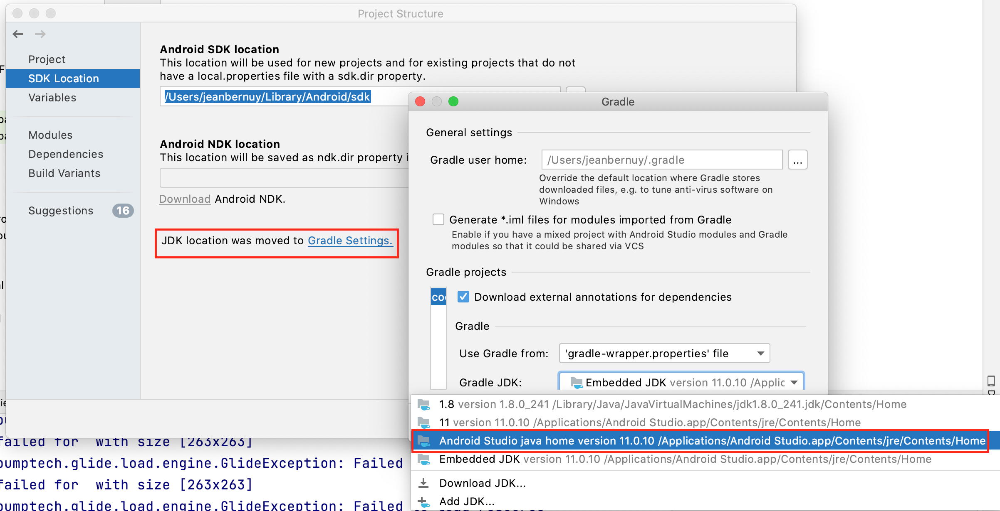
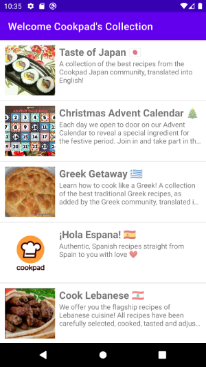
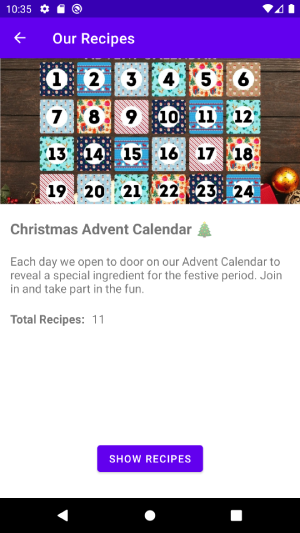

# Test

## General

[1- Settings](#settings)
[2- Before you start](#before-you-start)
[3- Libraries Used](#libraries-used)
[4- About the project](#about-the-project)
[5- Notes](#notes)

## Settings

This project has been created with gradle version 7.0, to build please check that you have the Java 11 version setting in your project structure.

[Go to Real Cool Heading section](#notes)

## Before you start
This project requires the following

1. Android Studio Arctic Fox | 2020.3.1 Patch 4
2. Android SDK 23 or above.
3. Android build tools gradle 7.0.4.

This is a app built with Kotlin.

## Libraries Used
- MVVM - ViewModel
- Fragments
- Safe Args
- LiveData
- Android KTX
- Coroutines
- Retrofit
- Navigation Components
- Scope Functions
- ViewBinding
- Unit Tests (MockK)

## About the project
All the data is coming from the API.
The response contains a list of collections items as well as URLs to the pictures associated with each recipe.

This is a sample Cookpad Recipes app that is supposed to display collections list and the details.
The first page displays collections list, when one of the items is clicked, it is supposed to show the detail.

|  |  |

## Notes
1. It is possible that some of the collections do not have images.

